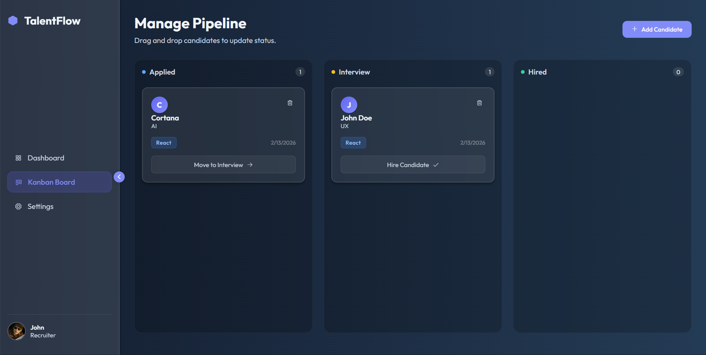

# TalentFlow v2.0 🚀
**A Mobile-First, Responsive Hiring Platform**

TalentFlow is a modern Applicant Tracking System (ATS) designed to mimic a native application experience. It features a dual-view pipeline (Kanban Board & List View), a mobile-first architecture with touch-friendly navigation, and persistent local state management.




## 🔗 Live Demo
**[View Live Demo](#)** *(Replace with your Netlify/GitHub link)*

## ✨ Key Features (v2.0)

### 📱 Mobile-First Experience
* **Responsive Navigation:** Automatically switches from a Sidebar (Desktop) to an App-style Bottom Navigation Bar (Mobile).
* **Touch Interactions:** Includes "Ripple" click effects and touch-friendly buttons.
* **Mobile Fallbacks:** Smartly handles Drag & Drop limitations on mobile by providing manual "Move" buttons for touch users.

### 📊 Dual-View Pipeline
* **Kanban Board:** Classic drag-and-drop interface for visual stage management.
* **List View:** A dense, spreadsheet-style view for quick scanning and management of large candidate pools.
* **Real-Time Toggle:** Instantly switch between views without losing context or filters.

### ⭐ Candidate Scoring
* **Star Rating System:** Rate candidates from 1-5 stars during intake or review.
* **Visual Indicators:** Ratings are visible in both Card and List modes for quick prioritization.

### 🎨 Modern UI/UX
* **Glassmorphism:** Frosted glass aesthetic (`backdrop-filter`) with a "Deep Abyss" gradient theme.
* **Micro-Interactions:** Smooth CSS transitions for modals, view switching, and hover states.
* **Toast Notifications:** Custom, non-intrusive popup alerts for user feedback (Success/Error states).

## 🛠️ Technical Implementation

* **Architecture:** Modular Vanilla JavaScript (ES6+) with clear separation of State, Render Logic, and Event Handling.
* **State Management:** Centralized state object synced with `localStorage` for data persistence across sessions.
* **CSS Variables:** Extensive use of CSS Custom Properties for consistent theming and easy maintenance.
* **Zero Dependencies:** Built entirely without external frameworks (React/Vue) to demonstrate core DOM manipulation skills.

## 📂 Project Structure

```text
/TalentFlow
  ├── index.html        # Main DOM structure (includes Views, Modals, Navs)
  ├── style.css         # All styles (Glassmorphism, Mobile Media Queries, Animations)
  ├── app.js            # Core Logic (State, Drag&Drop, View Switching)
  └── README.md         # Documentation
